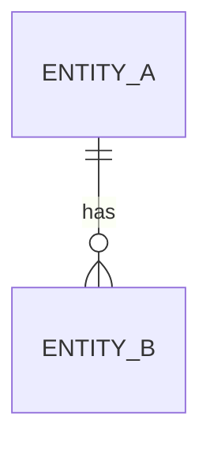

# 05 · Domain model

> **Estado:** v0.1 — borrador (plantilla).

## 1. Objetivo y audiencia

Entidades persistentes (`DOMAIN-*`) para **Jeny Fit**.

## 2. Contexto (tenant / ownership)

<!-- Quién es el dueño de los datos; multi-tenant o single-tenant. -->

## 3. Diagrama ER (MVP)

## 4. Entidades

### EntityName (`DOMAIN-001`)

| Campo | Tipo | Notas |
|-------|------|-------|
| id | uuid | PK |
| … | … | … |

## 5. Relaciones y cardinalidad

## 6. Verificación cruzada (docs 01–04, 06)

## 7. Decisiones cerradas (historial)

| ID | Decisión |
|----|----------|

## 8. Referencias

- [`06-business-rules.md`](06-business-rules.md)
- [`09-backend-architecture.md`](09-backend-architecture.md)
