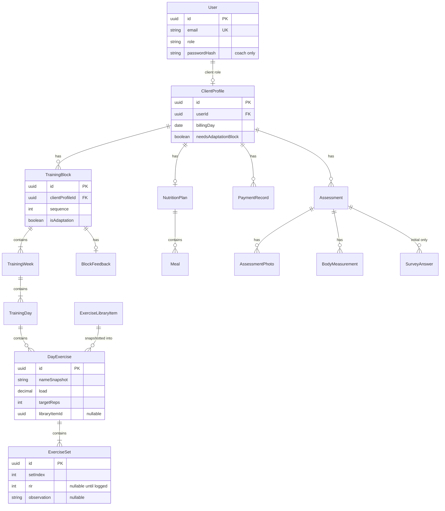

# 05 · Domain model

> **Estado:** v1.0 — modelo MVP cerrado (`DOMAIN-001`…`016`, `DOMAIN-020`…`026`). Encuesta copy = `MVP-OPEN-02`.

## 1. Objetivo y audiencia

Entidades persistentes (`DOMAIN-*`) para **Jeny Fit**. Contrato para schema/migrations (doc 09); no inventar campos fuera de 01–04 / `MVP-*`.

## 2. Contexto (tenant / ownership)

- **Single-coach MVP** (`MVP-016`): no hay tabla `Organization` multi-tenant.
- **Owner lógico:** la cuenta `User` con rol `coach` (Jeny) es dueña del portafolio.
- **Cliente:** `User` con rol `client` + perfil `ClientProfile` 1:1; solo ve sus datos.
- **Biblioteca de ejercicios:** global al coach (única en el sistema MVP).

## 3. Diagrama ER (MVP)

## 4. Entidades

### User (`DOMAIN-001`)

| Campo | Tipo | Notas |
|-------|------|-------|
| id | uuid | PK |
| email | string | UK; identidad del cliente (magic link) |
| role | enum | `coach` \| `client` |
| passwordHash | string? | Solo coach; null en client |
| name | string? | Display |
| createdAt | datetime | |

### ClientProfile (`DOMAIN-002`)

| Campo | Tipo | Notas |
|-------|------|-------|
| id | uuid | PK |
| userId | uuid | FK → User (UK, 1:1) |
| billingAnchorDay | int 1–31 | Día de cobro mensual (default = día del alta) |
| needsAdaptationBlock | bool | Decisión manual al alta |
| heightCm | decimal? | Base valoración |
| sex | enum? | Para escalas de referencia |
| birthDate | date? | Fuente de edad (no persistir solo `age`) |
| createdAt | datetime | |

Estado de pago (**al día / próximo a vencer / vencido**) es **derivado** (no columna obligatoria): ancla + último `PaymentRecord` + regla 7 días (`MVP-008`).

### ExerciseLibraryItem (`DOMAIN-003`)

| Campo | Tipo | Notas |
|-------|------|-------|
| id | uuid | PK |
| name | string | |
| notes / mediaUrl | string? | Opcional MVP |
| active | bool | Soft-delete (`false` = oculto; no borrar filas con snapshots) |
| createdAt / updatedAt | datetime | |

### TrainingBlock (`DOMAIN-004`)

| Campo | Tipo | Notas |
|-------|------|-------|
| id | uuid | PK |
| clientProfileId | uuid | FK |
| sequence | int | Orden en el plan del cliente |
| isAdaptation | bool | Bloque de adaptación |
| label | string? | Opcional |
| createdAt | datetime | |

**Regla de forma:** 4 semanas; la 4ª es descarga (enforce en app/`BR-*`, no solo UI).

### TrainingWeek (`DOMAIN-005`)

| Campo | Tipo | Notas |
|-------|------|-------|
| id | uuid | PK |
| blockId | uuid | FK |
| weekIndex | int | 1–4 |
| isDeload | bool | true si weekIndex = 4 |

### TrainingDay (`DOMAIN-006`)

| Campo | Tipo | Notas |
|-------|------|-------|
| id | uuid | PK |
| weekId | uuid | FK |
| dayIndex | int | Orden secuencial dentro de la semana / plan |
| calendarLabel | string | Ej. "Lunes" (etiqueta acordada; no gobierna navegación) |
| closedAt | datetime? | Set al cerrar el día; status UI **derivado** (no columna `status`) |

### DayExercise (`DOMAIN-007`) — snapshot

| Campo | Tipo | Notas |
|-------|------|-------|
| id | uuid | PK |
| dayId | uuid | FK |
| sortOrder | int | |
| libraryItemId | uuid? | Ref opcional a biblioteca |
| nameSnapshot | string | **Obligatorio** (copia) |
| load | decimal | Carga / peso prescrito |
| targetSets | int | Nº series planificadas |
| targetReps | int o string | Reps objetivo |
| notes | string? | Indicaciones coach |

Campos mínimos cerrados (ex-`DOMAIN-OPEN-02`): **nombre, carga, series, reps, id biblioteca**.

### ExerciseSet (`DOMAIN-008`)

| Campo | Tipo | Notas |
|-------|------|-------|
| id | uuid | PK |
| dayExerciseId | uuid | FK |
| setIndex | int | 1..N |
| rir | int? | Null hasta registrar |
| observation | string? | Opcional |
| updatedAt | datetime | |

Video por serie: **no** en MVP.

### NutritionPlan (`DOMAIN-009`)

| Campo | Tipo | Notas |
|-------|------|-------|
| id | uuid | PK |
| clientProfileId | uuid | FK UK (un plan vigente 1:1 en MVP) |
| updatedAt | datetime | Independiente de bloques |

### Meal (`DOMAIN-010`)

| Campo | Tipo | Notas |
|-------|------|-------|
| id | uuid | PK |
| nutritionPlanId | uuid | FK |
| mealIndex | int | 1–6 (“Comida N”) |
| protein | string | Cantidad sugerida (texto libre o “200g”, etc.) |
| carbs | string | Cantidad sugerida |
| vegetables | string | Cantidad sugerida |
| fats | string | Cantidad sugerida |
| notes | string? | Otras indicaciones |

### BlockFeedback (`DOMAIN-011`)

| Campo | Tipo | Notas |
|-------|------|-------|
| id | uuid | PK |
| blockId | uuid | FK UK |
| body | text | Nota de Jeny |
| createdAt / updatedAt | datetime | |

### PaymentRecord (`DOMAIN-012`)

| Campo | Tipo | Notas |
|-------|------|-------|
| id | uuid | PK |
| clientProfileId | uuid | FK |
| markedPaidAt | datetime | Cuando Jeny marcó pagado |
| periodStart / periodEnd | date | Período que cubre |
| amountUsd | decimal? | Opcional; se puede marcar pagado sin monto |
| notes | string? | Medio (transferencia, etc.) |

### Assessment (`DOMAIN-013`)

| Campo | Tipo | Notas |
|-------|------|-------|
| id | uuid | PK |
| clientProfileId | uuid | FK |
| type | enum | `initial` \| `monthly_followup` |
| status | enum | `open` \| `submitted` … |
| openedByUserId | uuid | Coach que abre (follow-up) |
| weightKg | decimal? | |
| submittedAt | datetime? | |
| createdAt | datetime | |

Máximo **un** `initial` por cliente. Follow-ups: N.

### AssessmentPhoto (`DOMAIN-014`)

| Campo | Tipo | Notas |
|-------|------|-------|
| id | uuid | PK |
| assessmentId | uuid | FK |
| storageKey / url | string | |
| label | string? | Ángulo / vista |
| createdAt | datetime | |

### BodyMeasurement (`DOMAIN-015`)

| Campo | Tipo | Notas |
|-------|------|-------|
| id | uuid | PK |
| assessmentId | uuid | FK |
| metric | enum | Las **12** circunferencias `MVP-014` |
| valueCm | decimal | |

### SurveyAnswer (`DOMAIN-016`)

| Campo | Tipo | Notas |
|-------|------|-------|
| id | uuid | PK |
| assessmentId | uuid | Solo assessment `initial` |
| questionKey | string | Keys canónicas → `MVP-OPEN-02` |
| answerType | enum | `closed` \| `free_text` |
| value | json/text | |

**No** se crean en follow-ups mensuales.

## 5. Relaciones y cardinalidad

| Desde | Hasta | Cardinalidad |
|-------|-------|--------------|
| User (client) | ClientProfile | 1:1 |
| ClientProfile | TrainingBlock | 1:N |
| TrainingBlock | TrainingWeek | 1:4 |
| TrainingWeek | TrainingDay | 1:N (días/semana variables) |
| TrainingDay | DayExercise | 1:N |
| DayExercise | ExerciseSet | 1:N |
| ExerciseLibraryItem | DayExercise | 1:N (soft; snapshot) |
| ClientProfile | NutritionPlan | 1:1 (MVP) |
| NutritionPlan | Meal | 1:0..6 |
| TrainingBlock | BlockFeedback | 1:0..1 |
| ClientProfile | PaymentRecord | 1:N |
| ClientProfile | Assessment | 1:N |
| Assessment | Photo / Measurement / SurveyAnswer | 1:N |

### Avance secuencial (concepto)

No hay entidad “cursor” obligatoria: el **día actual** = primer `TrainingDay` del cliente (orden global bloque→semana→día) cuyo cierre/RIR no está completo. Si no hay día futuro planeado tras completar el último → estado UI “esperando próximo bloque”.

## 6. Verificación cruzada (docs 01–04, 06)

| Tema | Entidades | Flows |
|------|-----------|-------|
| Auth / alta | User, ClientProfile | FLOW-001…004 |
| Biblioteca + snapshot | ExerciseLibraryItem, DayExercise | FLOW-005, 006 |
| RIR / cierre | ExerciseSet, TrainingDay | FLOW-008…010 |
| Nutrición | NutritionPlan, Meal | FLOW-007 |
| Feedback | BlockFeedback | FLOW-011, 012 |
| Pagos | ClientProfile.billingAnchorDay, PaymentRecord | FLOW-014, 015 |
| Valoración | Assessment* | FLOW-016, 017 |

## 7. Decisiones cerradas (historial)

| ID | Decisión |
|----|----------|
| DOMAIN-020 | Single-coach; sin entity Org multi-tenant en MVP (`MVP-016`) |
| DOMAIN-021 | Snapshot mínimo en `DayExercise`: name, load, targetSets, targetReps, libraryItemId? |
| DOMAIN-022 | Estados de pago **derivados**; historial en `PaymentRecord` |
| DOMAIN-023 | Assessment `initial` único; follow-up sin `SurveyAnswer` |
| DOMAIN-024 | Resultado diagnóstico **no** es entidad persistida en MVP (`MVP-015`) |
| DOMAIN-025 | Edad vía `birthDate` (no campo `age` persistido) |
| DOMAIN-026 | `Meal`: columnas `protein`, `carbs`, `vegetables`, `fats` + `notes?`; día sin columna `status` (derivado + `closedAt`) |

## 8. Fuera del modelo MVP

- Video por serie
- Entidad Document/PDF de resultado diagnóstico
- Multi-coach / Organization
- Recetas / food database

## 9. Referencias

- [`00-coherence-index.md`](00-coherence-index.md)
- [`02-scope-mvp.md`](02-scope-mvp.md)
- [`03-user-roles.md`](03-user-roles.md)
- [`04-user-flows.md`](04-user-flows.md)
- [`06-business-rules.md`](06-business-rules.md)
- [`09-backend-architecture.md`](09-backend-architecture.md)
